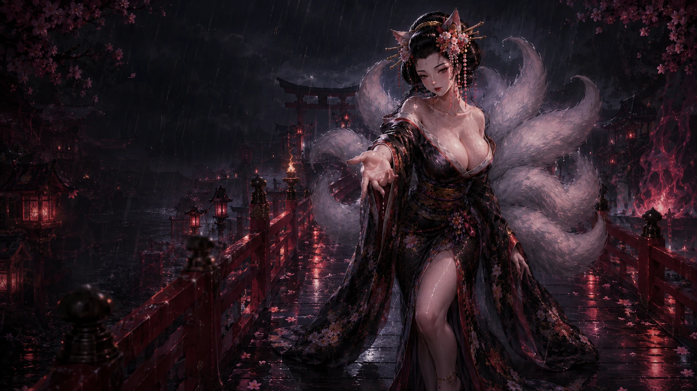
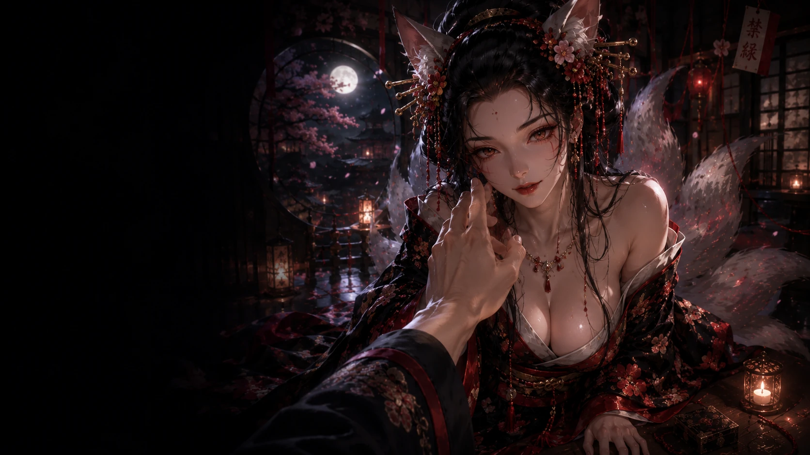
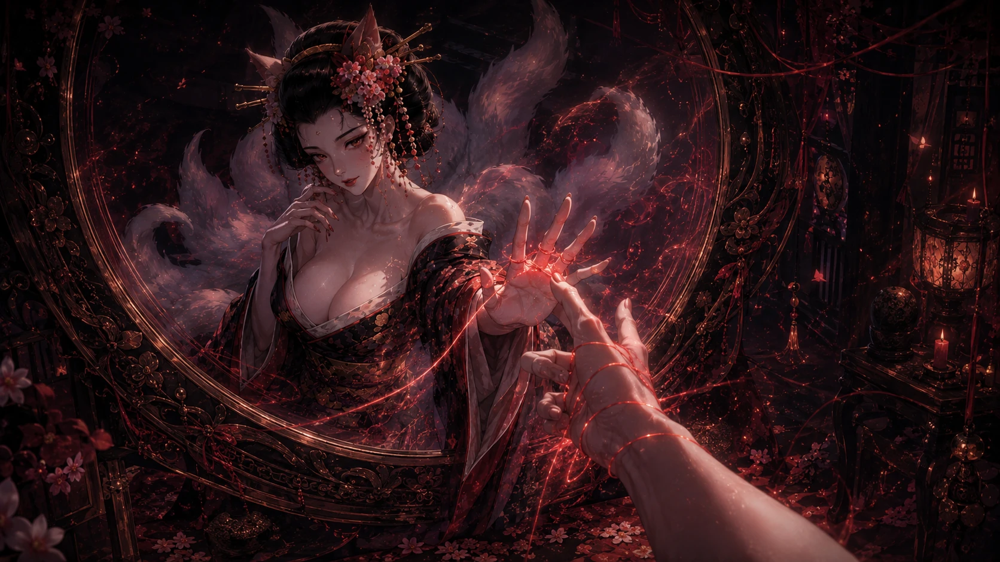
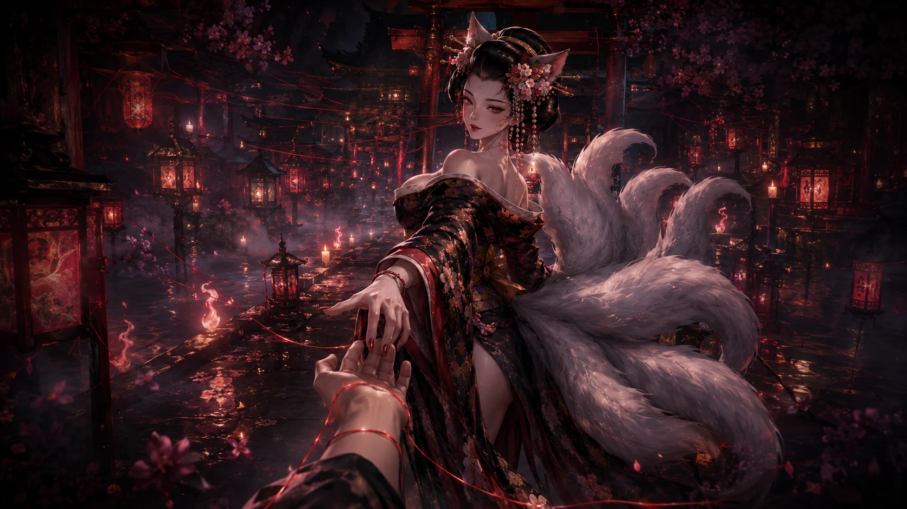
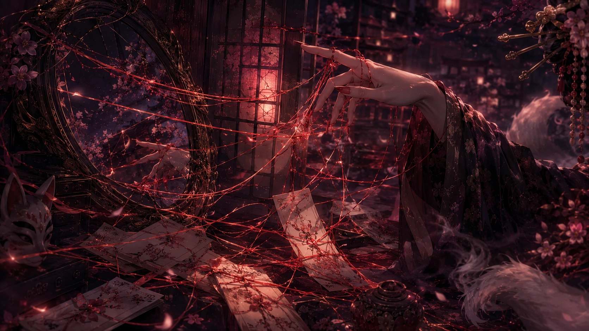
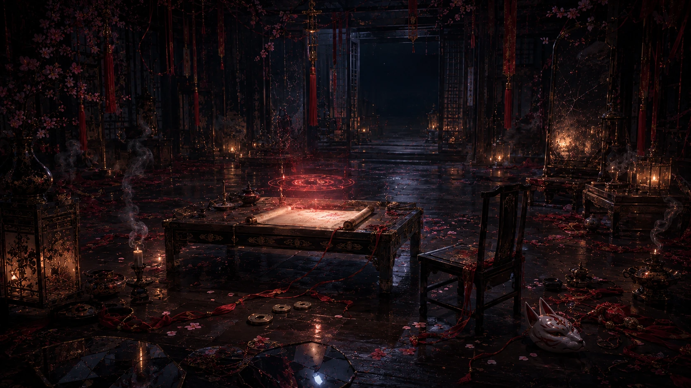

# 緣之卷｜圖片視覺審核 V1

> 對照：`../01_LOVE_SCENE_LOCK_V1.md`

## 01 `love.threshold`｜雨廊邀請

**故事**：九尾伸手但不抓玩家，等玩家自己跨半步。

**桌機現圖**  

**手機候選**  

- 安全區：`S-L`
- 檢查：狐耳、頭、伸手、雨廊、月夜；人物不可超過約 45%。
- 決策：🟡 桌機優先保留；手機改驗真正配對圖。
- 鎖定：⬜

---

## 02 `love.face`｜臉前一寸

**故事**：玩家決定碰臉、停在唇前或收手。

**主圖**  

**反應圖：碰臉**  

**反應圖：唇前停手**  

**反應圖：收手**  

- 安全區：`S-CLOSE`
- 必看：狐耳、眼、唇、脖、胸線、玩家手。
- 程式：🔧 hotspot 改 normalized/SVG。
- 決策：🟡 圖先留，互動根治。
- 鎖定：⬜

---

## 03 `love.question`｜第一問

**桌機**  

**手機**  

- 故事：鏡面紅線進黑暗，玩家說出最怕成真的一句。
- 安全區：`S-R`，不可遮鏡中紅線。
- 決策：🟢 圖保留；🔧 選項改自然繁中對話。
- 鎖定：⬜

---

## 04 `love.wrist`｜纏腕

**桌機**  

**手機**  

- 故事：紅線勒緊玩家手腕，玩家決定拉回、鬆手或改握九尾。
- 安全區：`S-EVIDENCE`，絕不蓋手腕與拉緊處。
- 決策：🟢 優先保留。
- 鎖定：⬜

---

## 05 `love.evidence`｜第一項證據

**目前錯位圖**  

**優先候選桌機**  

**優先候選手機**  

- 故事：最近三次「下一次」究竟是誰提出並讓它發生。
- 安全區：`S-EVIDENCE`
- 必須：日期／邀約／行程／紙籤等證據，不能只有性感近唇。
- 決策：🟠 優先改用 `LOVE_VERIFY_01`；若證據仍不夠明確才 🎨 新圖。
- 鎖定：⬜

---

## 06 `love.thread-room`｜線室

**桌機現圖**  

**手機現圖**  

- 故事：所有未寄出的信只連同一隻手，鏡中沒有第二雙手。
- 安全區：`S-EVIDENCE`
- 必須實際看見：鏡、信件、單方紅線、另一側空白。
- 決策：🟠 缺任一核心元素就換圖／生圖。
- 鎖定：⬜

---

## 07 `love.proximity`｜近身

**桌機**  

**手機**  

- 故事：被渴望不等於被選擇。
- 安全區：`S-CLOSE`
- 九尾可大，但不能裁掉狐耳、眼神、伸手。
- 決策：🟢 圖留；🔧 dynamic echo 改九尾短台詞。
- 鎖定：⬜

---

## 08 `love.silence`｜沉默之後

**桌機現圖**  

**手機現圖**  

- 故事：沉默後誰真的把關係接回來。
- 安全區：`S-EVIDENCE`
- 必須：斷／熄的紅線、重新接回的痕跡、冷靜的九尾。
- 決策：🟠 若只是普通長廊美圖，換現有素材或新圖。
- 鎖定：⬜

---

## 09 `love.turn`｜紅線反咬

**目前圖**  

- 故事：紅線從鏡後繞回玩家自己的倒影；空椅仍被玩家整理。
- 安全區：鏡面優先；文字用窄側欄／下方短句。
- 必須：玩家倒影、空椅、紅線回纏自己、九尾側看、微恐怖。
- 決策：🔴 高機率專用新圖。
- 鎖定：⬜

---

## 10 `love.last-proof`｜最後一證

**現圖**  

- 故事：兩端都不碰線，讓現實自己走。
- 安全區：`S-EVIDENCE`
- 必須：桌上紅線、九尾手離線、玩家不碰。
- 決策：🟡 保留重驗；移除不必要的 `heroPresence: empty` 思維。
- 鎖定：⬜

---

## 11 `love.pulse-trial`｜觸線試煉

**主圖候選**  

- 故事：玩家親手碰紅線，線只亮一次。
- 安全區：`S-OPERATE`
- 互動：單一 hotspot。
- 決策：🔧 從上一幕普通 choice 拆成獨立操作幕；主圖與反應圖另驗。
- 鎖定：⬜

---

## 12 `love.result`｜緣卷命牒

**目前桌機圖**  

**另一候選**  

- 故事：九尾提筆正式寫下第一張命牒。
- 安全區：`S-DESTINY`
- 必須：左側 38–43vw 命牒安全區；九尾右側；手、筆、臉、胸不被紙擋。
- 程式：🔧 可見捲軸＋自動跟隨逐字內容。
- 決策：🔴 若兩張都沒有真正安全區，生成命牒專圖。
- 鎖定：⬜

---

## 13 `love.ritual`｜封線

**目前桌機純道具圖**  

**目前手機人物圖**  

- 故事：未結腕線／鏡前斷餘／門環留線。
- 安全區：`S-OPERATE`
- 必須：九尾手或半身＋儀式道具；選後最好有視覺反應。
- 決策：🟠 桌機需換九尾＋道具構圖；無現圖才新生成。
- 鎖定：⬜

---

## 14 `love.ending`｜雨停以前

**桌機**  

**手機**  

- 故事：雨快停，九尾退開，紅線鬆弛。
- 安全區：`S-L`／`S-R`，只 1–2 句。
- 決策：🟢 桌機優先保留；🟡 手機確認角色一致性。
- 鎖定：⬜

---

# 緣卷下一輪優先順序

1. 第 05 幕：比較目前圖與 `LOVE_VERIFY_01`。
2. 第 06 幕：確認「沒有第二雙手」是否真的存在於畫面。
3. 第 08 幕：確認斷線／接線故事性。
4. 第 09 幕：若現圖缺紅線回纏玩家，直接列生圖。
5. 第 12 幕：確認兩張命牒候選的左側安全區。
6. 第 13 幕：找九尾＋道具替代圖。

只有以上圖片與桌機／手機實機都通過後，才回寫 `🔒`。
