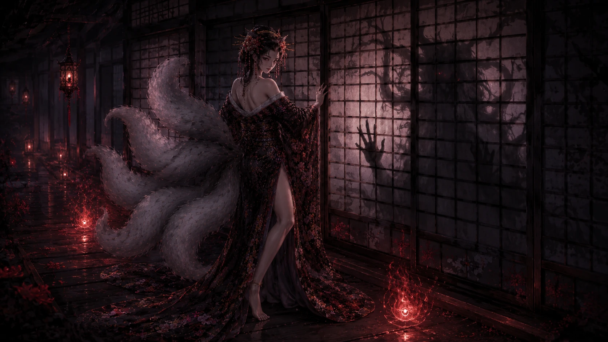
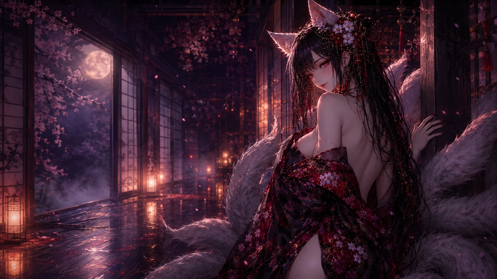
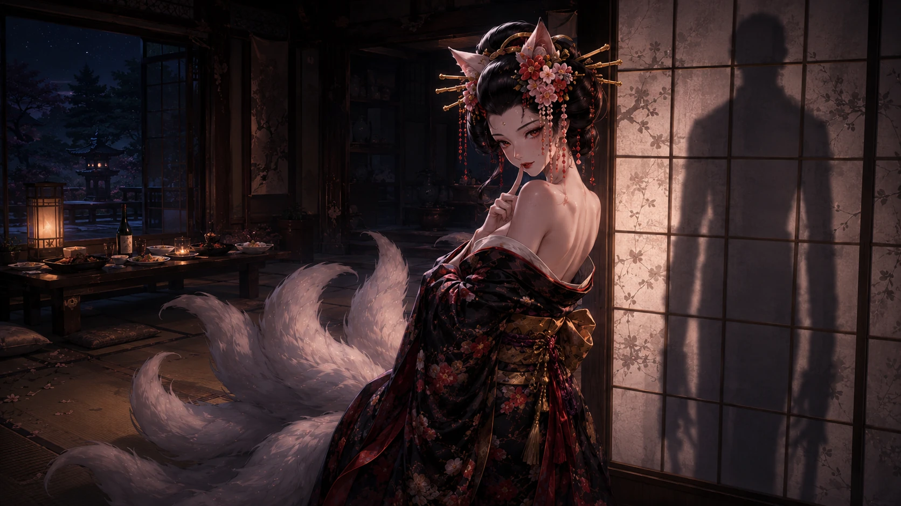
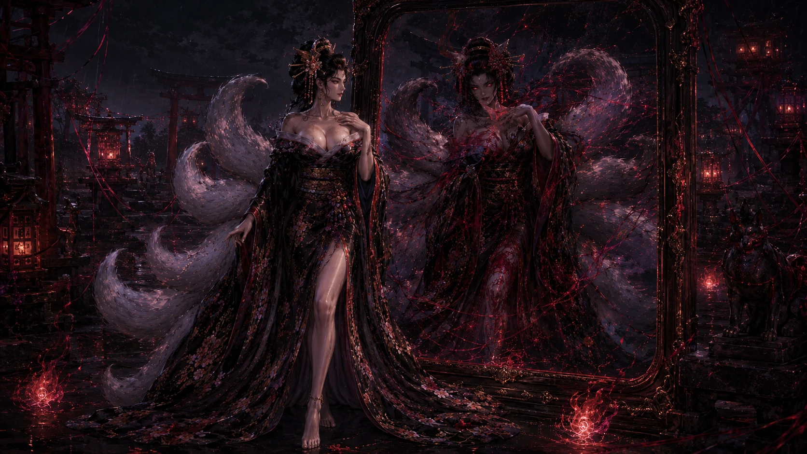
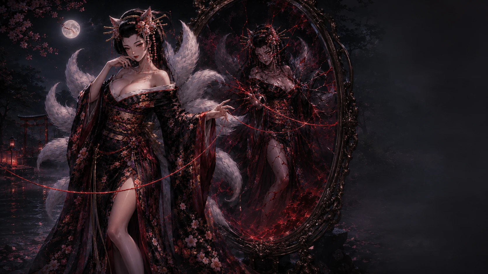
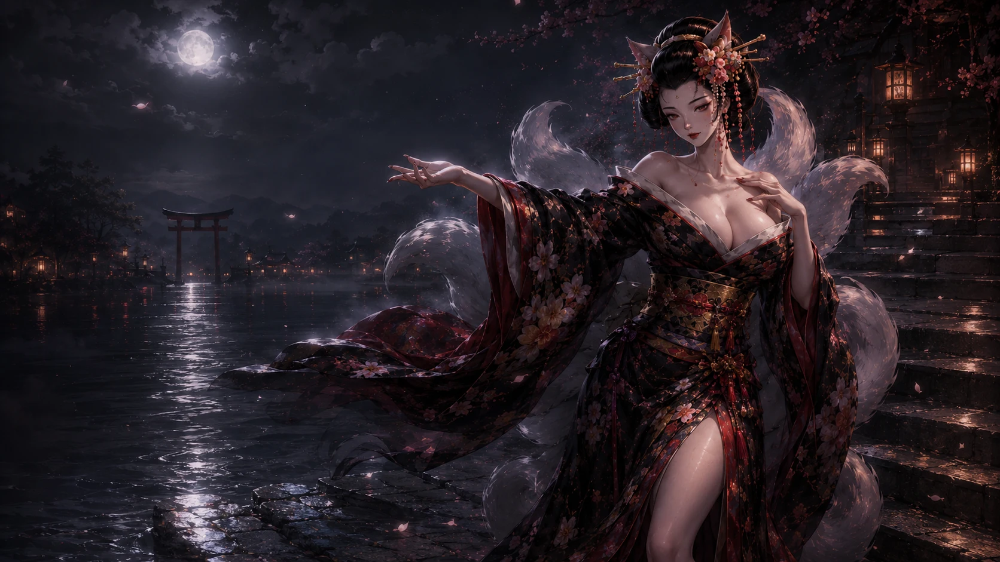
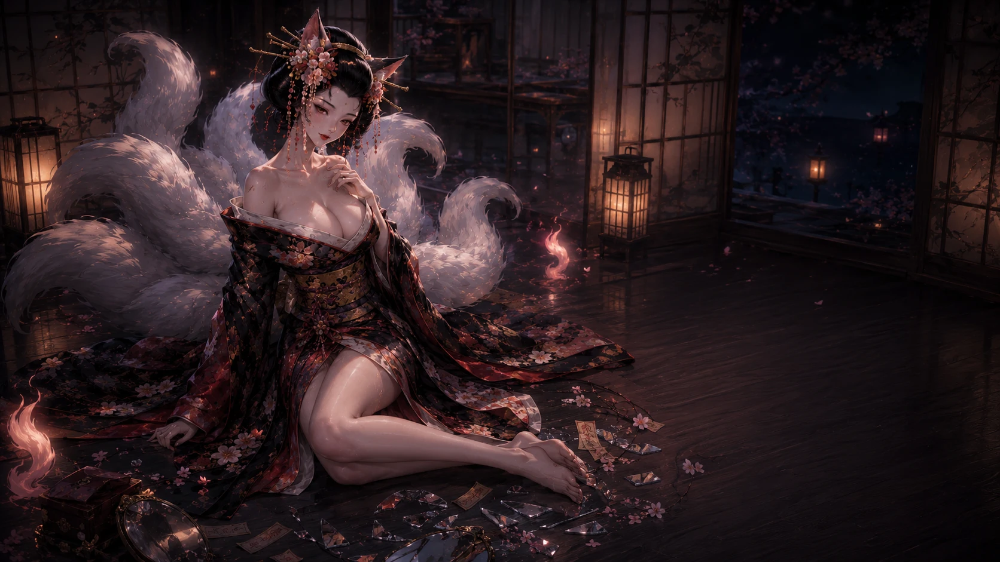

# 命之卷｜圖片視覺審核 V1

> 對照：`../03_LIFE_SCENE_LOCK_V1.md`

本檔用來逐幕核對命之卷目前圖片、故事符合度、桌機／手機安全區與最終圖片決策。

## 01 `life.threshold`｜水庭倒影

- 故事：先看倒影，再看自身狀態。
- 安全區：`S-L` / `S-R`
- 必須：水面、九尾、異常倒影都清楚。
- 決策：🟢 保留候選。 鎖定：⬜

## 02 `life.shadow`｜影子慢半拍

- 故事：紙門後的影子比現實慢一個呼吸。
- 安全區：`S-EVIDENCE`
- 必須：紙門、人物、不同步影子一眼可辨。
- 決策：🟢 保留候選。 鎖定：⬜

## 03 `life.room`｜潮濕長廊

- 故事：九尾讓玩家停下，檢視真正的休息與消耗。
- 安全區：`S-CLOSE` / `S-L`
- 決策：🟢 保留候選。 鎖定：⬜

## 04 `life.mirror`｜裂鏡

- 故事：玩家從碎鏡裡挑出一直沒說的那一句。
- 安全區：`S-EVIDENCE`
- 必須：裂鏡／碎片不可被文字遮住。
- 決策：🟢 保留候選。 鎖定：⬜

## 05 `life.double`｜鏡中不同步

- 故事：現實已轉身，鏡中仍停在原位。
- 安全區：`S-EVIDENCE`
- 注意：第五卷會回收此伏筆，但必須有新的敘事狀態。
- 決策：🟢 若不同步清楚則保留。 鎖定：⬜

## 06 `life.cost`｜命燈代價

- 故事：長期消耗開始留下可見痕跡。
- 安全區：`S-L` / `S-R`
- 決策：🟡 語意重驗。 鎖定：⬜

## 07 `life.turn`｜鏡外人

- 故事：鏡中那個永遠能撐的形象才是替身，真正的自己在鏡外等待。
- 安全區：`S-EVIDENCE`
- 必須：鏡內／鏡外身份差異清楚。
- 決策：🟠 高敘事頁，現圖不足就換圖。 鎖定：⬜

## 08 `life.last-proof`｜明天看得見的動作

- 故事：不發大誓，只挑一件可完成的改變。
- 安全區：`S-EVIDENCE`
- 決策：🟡 驗證四項象徵是否真的可視化。 鎖定：⬜

## 09 `life.body-trial`｜身體訊號試煉

- 故事：鏡面顯示玩家最先出現的緊繃訊號。
- 安全區：`S-OPERATE`
- 互動：hotspot 改 normalized/SVG，避免裁切後錯位。
- 決策：🔴 圖與互動必修。 鎖定：⬜

## 10 `life.result`｜命卷命牒

- 故事：九尾寫下命之卷判詞。
- 安全區：`S-DESTINY`
- 必須：四卷統一命牒語言，左側紙面＋右側九尾。
- 決策：🔴 命牒專用構圖。 鎖定：⬜

## 11 `life.ritual`｜照身碎片

- 故事：只帶走一小片鏡，完成命卷收束儀式。
- 安全區：`S-OPERATE`
- 必須：碎鏡、手勢、九尾；分支最好有視覺反應。
- 決策：🟢 主圖候選。 鎖定：⬜

## 12 `life.ending`｜鏡息餘韻

- 故事：影子與玩家終於同步，安靜收束。
- 安全區：短句側欄或 `S-CLOSE`。
- 注意：以 V58 實際 `story.js` 為準。
- 決策：🟡 驗證是否過度像泛用收尾圖。 鎖定：⬜

# 高優先
1. 鏡中不同步。
2. 鏡內替身／鏡外真身。
3. 操作試煉 hotspot。
4. 命卷命牒。
