# 禁之卷｜圖片視覺審核 V1

> 對照：`../04_FORBIDDEN_SCENE_LOCK_V1.md`

## 01 `forbidden.threshold`｜禁門符牆
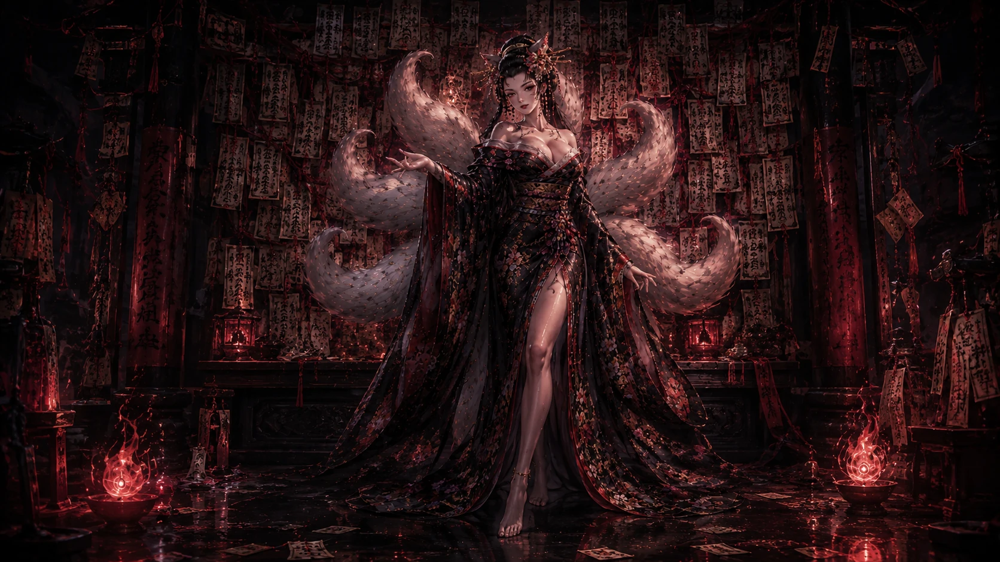
- 故事：這一卷不問對象，只看重複模式。
- 安全區：`S-R` / `S-L`
- 必須：符牆、九尾、無名規則感。
- 決策：🟢 保留候選。 鎖定：⬜

## 02 `forbidden.pattern`｜第一道重複
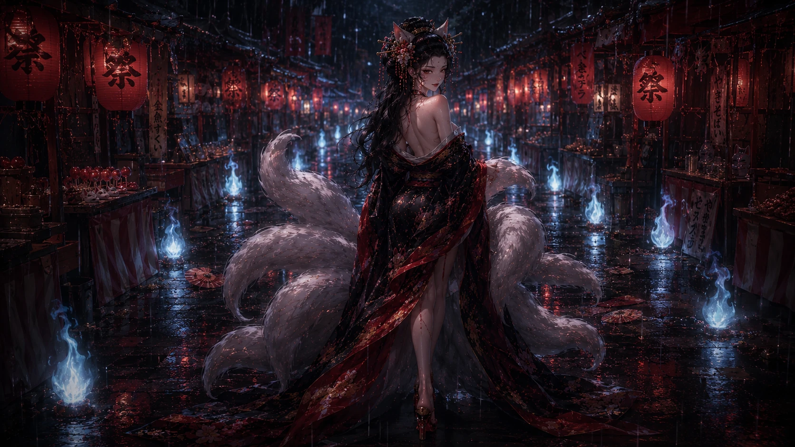
- 故事：不同的人，卻總在同一種時刻重演。
- 安全區：`S-EVIDENCE`
- 必須：多門／多人物／重複結構一眼能懂。
- 決策：🔴 高敘事頁；若只是暗黑人物圖就必須換。 鎖定：⬜

## 03 `forbidden.wrist`｜狐索束腕
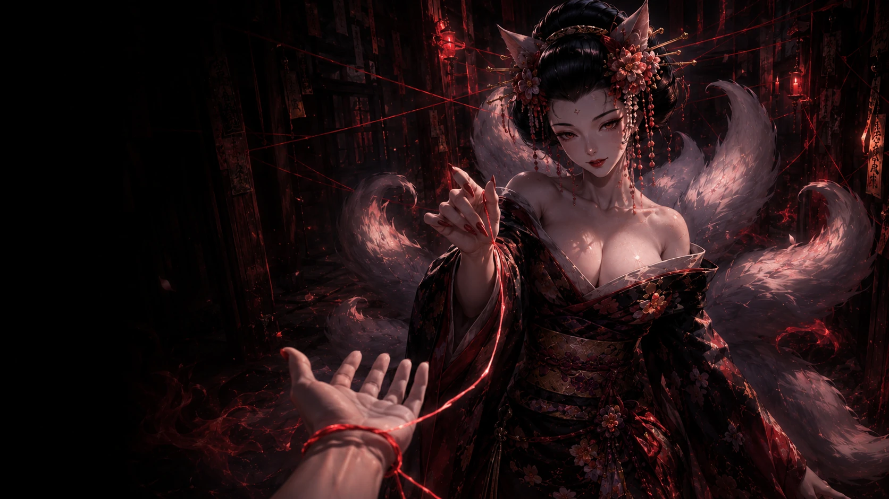
- 故事：手腕被束住，但繩結其實鬆得足以抽離。
- 安全區：`S-CLOSE` / `S-OPERATE`
- 必須：手腕、紅線、可見繩結、九尾觀察。
- 決策：🟢 保留候選；hotspot 另驗。 鎖定：⬜

## 04 `forbidden.bait`｜近火誘惑

- 故事：九尾用強烈吸引力測試玩家是否把感覺當成安全證據。
- 安全區：`S-CLOSE`
- 必須：誘惑與危險同時存在，不只是柔美肖像。
- 決策：🟢 保留候選。 鎖定：⬜

## 05 `forbidden.mask`｜狐面揭露
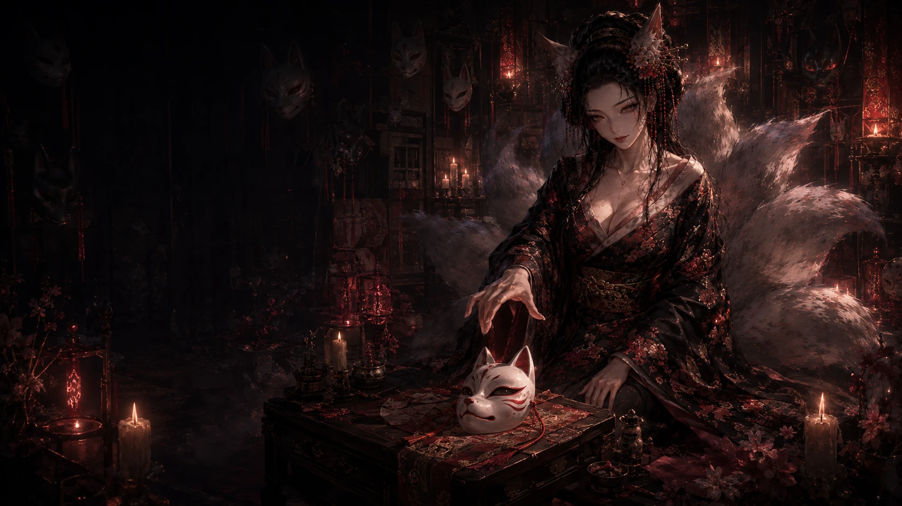
- 故事：狐面裡傳出的，是玩家曾替別人找理由的聲音。
- 安全區：`S-EVIDENCE`
- 必須：狐面與九尾臉同時清楚；面具內外關係可讀。
- 決策：🟢 保留候選。 鎖定：⬜

## 06 `forbidden.mirror`｜第二張狐面
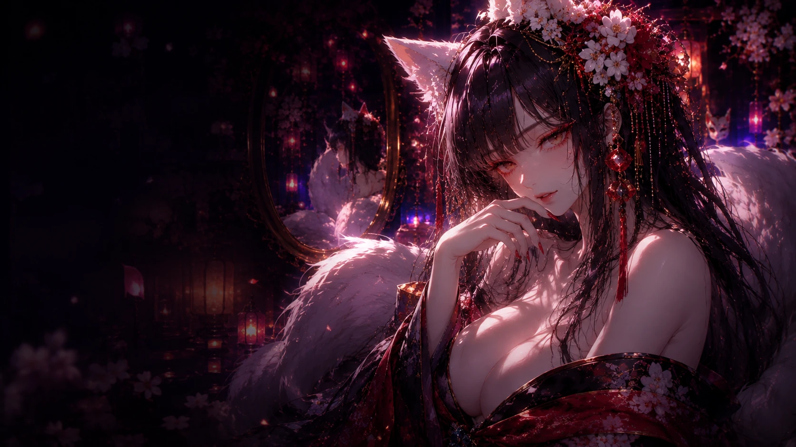
- 故事：玩家看見自己也會用沉默、消失、試探讓別人猜。
- 安全區：`S-EVIDENCE` / `S-CLOSE`
- 必須：鏡中自我照見，不只九尾凝視。
- 決策：🟡 圖留候選，需驗鏡中敘事。 鎖定：⬜

## 07 `forbidden.threat`｜重演廊
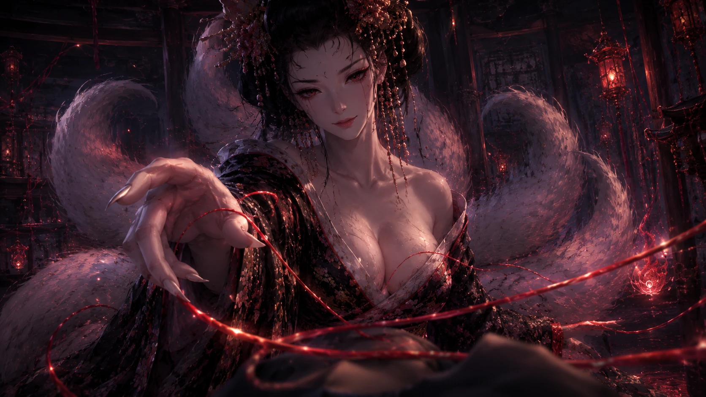
- 故事：四個不同的人，卻在同一種關鍵時刻重演。
- 安全區：`S-EVIDENCE`
- 必須：多重人物／影子／重複節奏，不能只靠文字說四個人。
- 決策：🟠 嚴格重驗。 鎖定：⬜

## 08 `forbidden.turn`｜面具認主
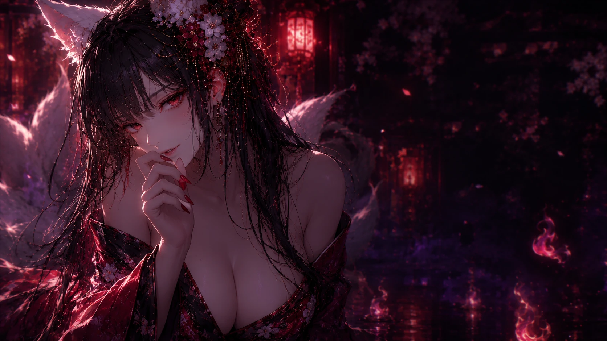
- 故事：狐面滑到玩家面前，內側刻著玩家自己的字跡。
- 安全區：`S-EVIDENCE`
- 必須：狐面移向玩家／認主感；九尾退後，不搶主體。
- 決策：🟠 現圖若只是暗黑肖像就換圖。 鎖定：⬜

## 09 `forbidden.last-proof`｜停止重演
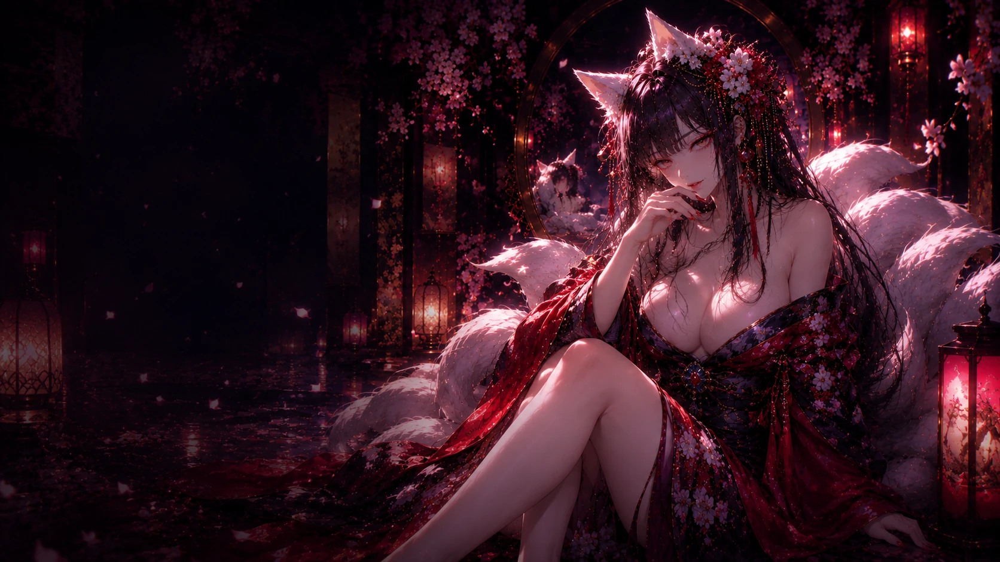
- 故事：九尾讓玩家在最熟悉的瞬間換一個動作。
- 安全區：`S-CLOSE` / `S-L`
- 必須：九尾仍保留魅惑，但畫面已轉向冷靜判讀。
- 決策：🟡 保留候選。 鎖定：⬜

## 10 `forbidden.heat-trial`｜最後一寸
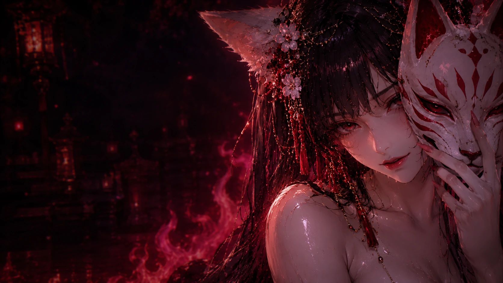
- 故事：最靠近危險的一瞬間，九尾突然停住，把選擇權交回玩家。
- 安全區：`S-OPERATE` / `S-CLOSE`
- 互動：若有面具／距離 hotspot，必須 normalized/SVG。
- 決策：🟡 圖留候選＋🔧 互動驗收。 鎖定：⬜

## 11 `forbidden.result`｜禁卷命牒
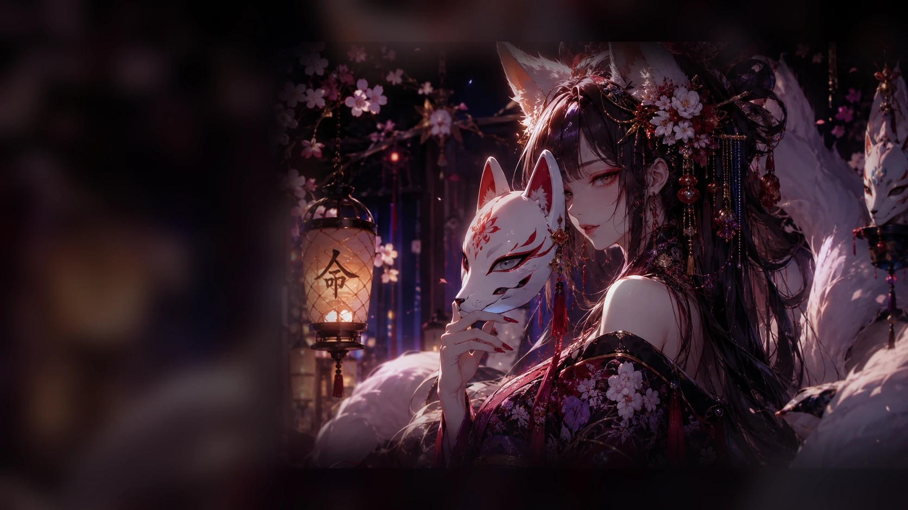
- 故事：面具終於肯認主，九尾寫下禁卷判詞。
- 安全區：`S-DESTINY`
- 已知問題：左側霧面存在於圖片像素，不是 CSS 可修。
- 必須：左側真命牒紙面＋右側九尾／狐面，文字區清楚。
- 決策：🔴 換原圖／重裁／專用新圖。 鎖定：⬜

## 12 `forbidden.ritual`｜卸面
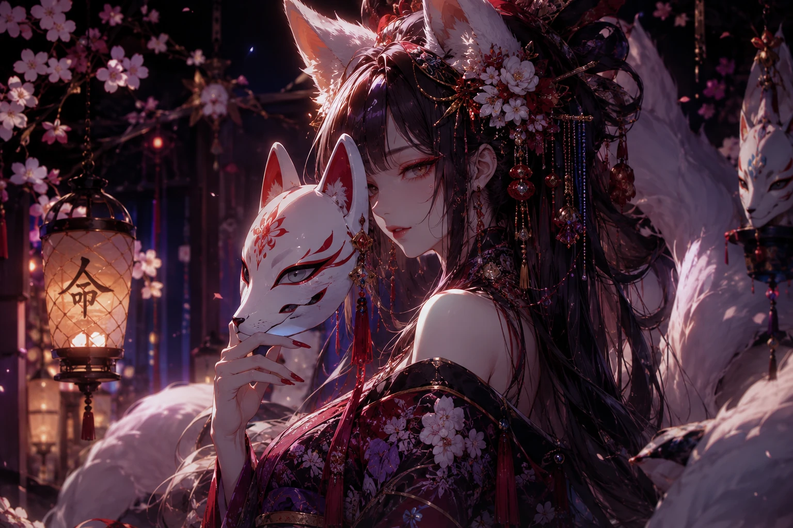
- 故事：寫下模式、摘下面具、燒掉一角三種收卷方式。
- 安全區：`S-OPERATE`
- 必須：九尾＋狐面＋手勢；三分支最好有視覺狀態變化。
- 決策：🟠 優先改善構圖／反應圖。 鎖定：⬜

## 13 `forbidden.ending`｜門後餘火

- 故事：沒有誰替玩家背罪，責任留下但罪名散掉。
- 安全區：短句側欄／`S-CLOSE`
- 注意：目前 V58 實際結尾與前面鏡面頁構圖重複感可能過高。
- 決策：🟠 優先找不同構圖的收尾圖，避免「又是同一張」感。 鎖定：⬜

# 禁卷高優先
1. `forbidden.pattern`｜重複模式畫面。
2. `forbidden.turn`｜狐面認主。
3. `forbidden.result`｜霧面命牒必修。
4. `forbidden.ritual`｜卸面分支視覺。
5. `forbidden.ending`｜避免與鏡面頁重複。
