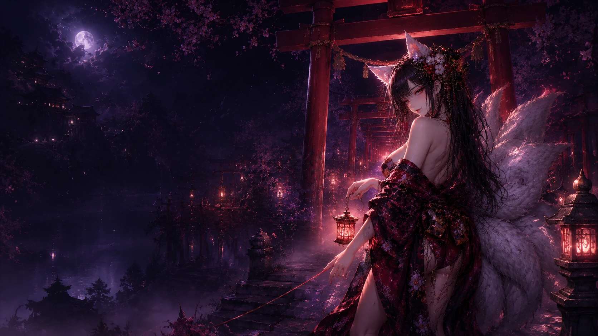
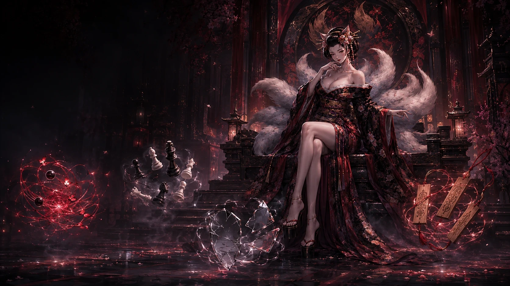
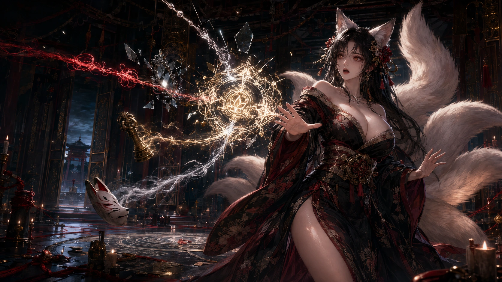
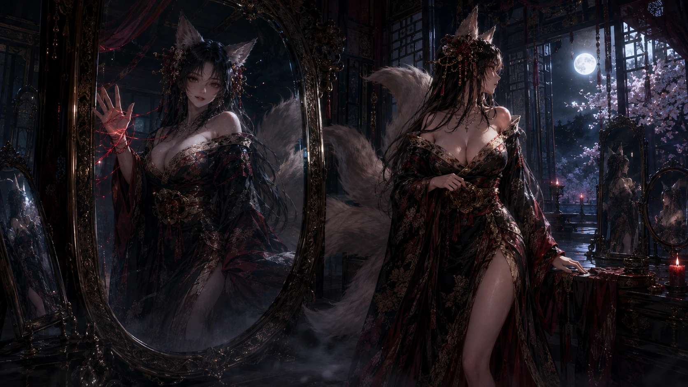
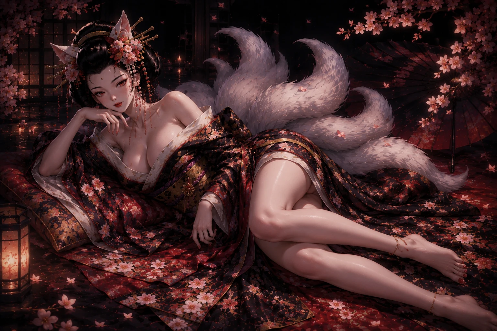
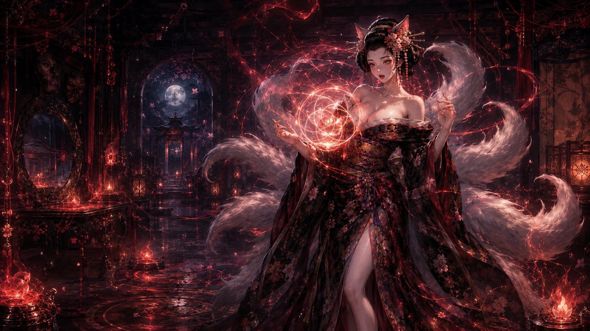
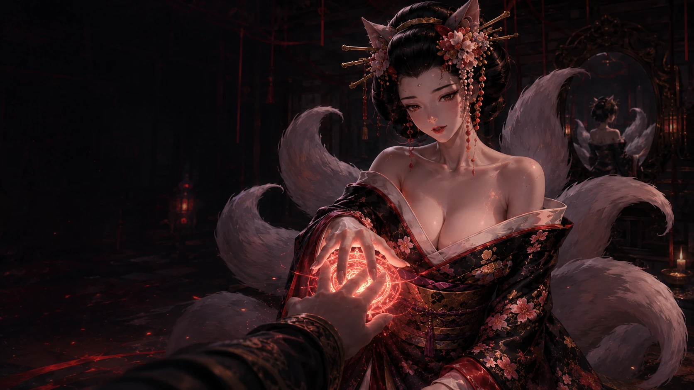
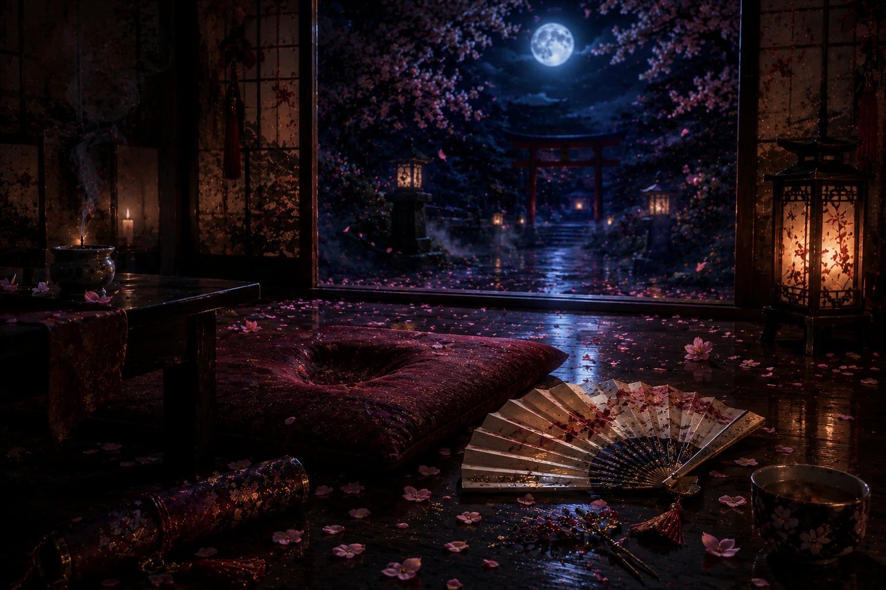
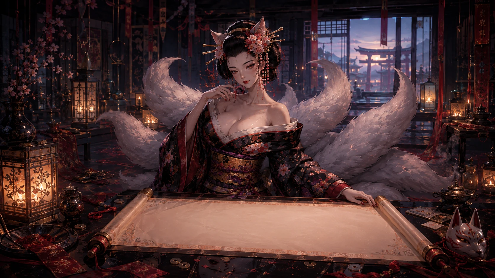
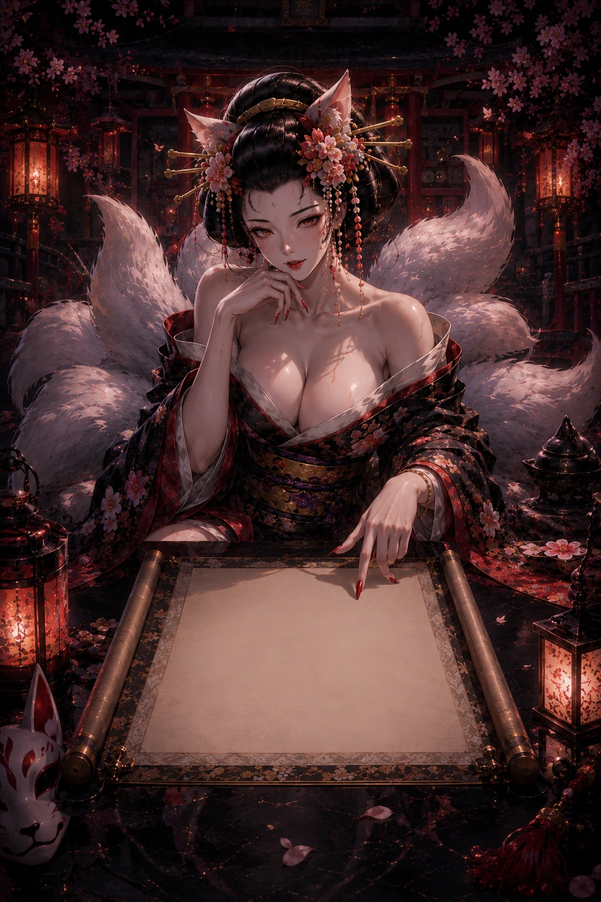

# 真命卷｜圖片視覺審核 V1

> 對照：`../05_FINALE_SCENE_LOCK_V1.md`

## 01 `finale.gate`｜無字第五門

- 故事：四卷完成後，多出一道本來不該存在的門；九尾第一次說「不對」。
- 安全區：`S-L` / `S-R`
- 必須：第五門與前四門有明顯差異；九尾表情不能仍是平常從容微笑。
- 決策：🟡 現圖保留候選，重點驗表情與無名門辨識度。 鎖定：⬜

## 02 `finale.relics`｜四痕上桌

- 故事：未結紅線、署名玄棋、照身鏡片、缺角狐面同時回到桌上。
- 安全區：`S-EVIDENCE`
- 必須：四件遺物都可辨認，九尾在桌後拆解／確認，不可只是一堆發光道具。
- 決策：🟢 保留候選。 鎖定：⬜

## 03 `finale.verdicts`｜四卷互證・九尾失控

- 故事：四個答案開始指向九尾自己，這是她第一次真正失去掌控。
- 安全區：`S-CLOSE` / `S-EVIDENCE`
- 必須：驚訝、 disbelief、微恐懼、失控；不能仍是誘惑式自信微笑。
- 人物：頭、狐耳、眼睛、唇、脖、胸線、手勢完整；可半起身或後退。
- 決策：🔴 關鍵高潮圖，表情不對就直接重生專用圖。 鎖定：⬜

## 04 `finale.cross`｜鏡中伏筆回返

- 故事：四卷一直在記另一個人；命卷的不同步伏筆被回收。
- 安全區：`S-EVIDENCE`
- 注意：這是刻意重用，不算偷懶，但第五卷呈現必須有新的光、遺物、台詞或構圖層次，讓玩家明白「回收伏筆」而不是「又看到同張圖」。
- 決策：🟡 保留伏筆圖，但需增加第五卷狀態差異。 鎖定：⬜

## 05 `finale.confession`｜九尾坦白

- 故事：九尾承認讓玩家走完四卷起初有私心，也承認自己害怕門開後玩家不再回來。
- 安全區：`S-CLOSE`
- 必須：距離近、脆弱、不再拿靠近當誘惑武器；手牽玩家貼上封印時，玩家仍能抽回。
- 決策：🟠 若現圖只是成熟性感躺姿而沒有「坦白／脆弱」，應換專用圖。 鎖定：⬜

## 06 `finale.seal-test`｜第五印形成

- 故事：狐火要求玩家立刻替九尾決定，第五印開始在她身上／兩人之間形成。
- 安全區：`S-OPERATE` / `S-CLOSE`
- 必須：第五印、九尾身體上的異常、玩家可介入的距離。
- 互動：印記／手勢 hotspot 需 normalized/SVG。
- 決策：🟡 主圖候選＋🔧 操作驗收。 鎖定：⬜

## 07 `finale.question`｜第五問

- 故事：這次沒有別人的名字，只問玩家自己。
- 安全區：`S-CLOSE`
- 必須：極簡、近身、安靜；不能再像前四卷選項問卷。
- 決策：🟠 若 shared 圖缺第五卷異常氛圍，換專用圖。 鎖定：⬜

## 08 `finale.choice`｜最後三選一

- 故事：答案、九尾，或一條沒有任何人替玩家命名的路。
- 安全區：`S-OPERATE`
- 已知：原圖頭臉完整，但目前 `desktopFocus=50% 58%` 可能把實機裁切壓得太低。
- 必須：先校焦點，再決定是否重生；三個最終選擇最好各有不同反應圖。
- 決策：🔴 先修 focus＋驗三分支反應，非必要不重生主圖。 鎖定：⬜

## 09 `finale.withdrawal`｜九尾消失

- 故事：九尾、尾影與呼吸聲突然全部消失，只剩四痕、紅線與手書。
- 安全區：`S-EVIDENCE`
- 必須：房間真的空；紅線仍有餘熱／微光；不可以又讓九尾留在角落。
- 決策：🟢 保留候選。 鎖定：⬜

## 10 `finale.ending`｜總命牒

- 故事：九尾重新出現，親手展開整夜唯一的總命牒。
- 安全區：`S-DESTINY`
- 已知重大問題：桌機圖九尾目前位在畫面中央，而左側總命牒約 43vw，必然互相遮擋。
- 正式需求：九尾右側 55–90%；左側 0–42% 保留完整白色總命牒區；手、臉、胸、尾巴不可被紙蓋；手機需獨立直式構圖。
- 命牒：標題固定、內文可捲、捲軸可見、逐字自動跟隨。
- 決策：🔴 桌機總命牒高機率專用新圖；手機另獨立驗收。 鎖定：⬜

---

# 真命卷額外必做：最終三選一反應圖

最終選擇不能三條路都只換文字，應各有九尾不同反應：

1. **選答案／完成第五印**：九尾由失控轉成安靜接受，封印真正落定。
2. **選九尾／留在她身邊**：九尾驚訝後出現極短暫的脆弱與靠近，不用過度甜化。
3. **選自己的路／拒絕替任何人命名**：九尾先停住，再放手；情緒是失落但尊重，不可做成懲罰玩家。

每張都需：明確成年九尾、同臉型／狐耳／黑紅和服／九尾一致；構圖與表情有實質差異。

# 真命卷高優先
1. `finale.verdicts`｜九尾第一次真正失控。
2. `finale.confession`｜脆弱坦白不能只靠性感 shared 圖。
3. `finale.choice`｜先修焦點，再做三條反應。
4. `finale.ending`｜總命牒構圖衝突最高優先。
